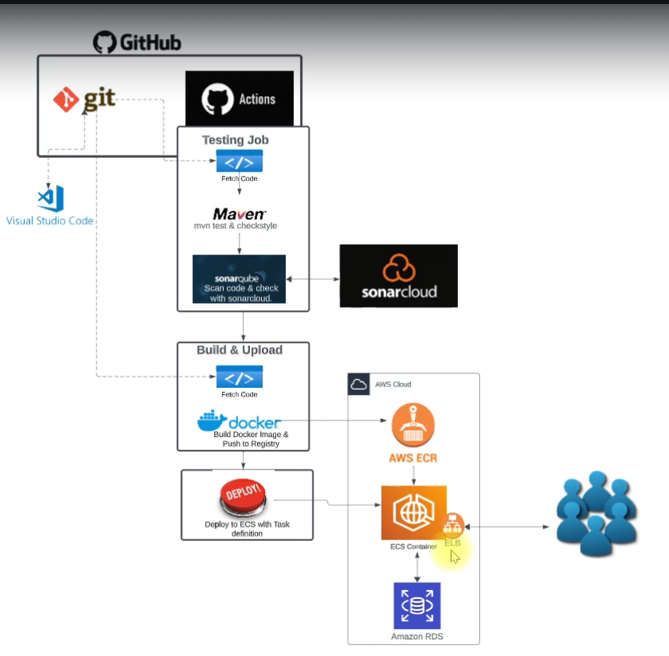

# Java App CI/CD Pipeline with GitHub Actions

This project demonstrates a complete **Continuous Integration (CI)** and **Continuous Deployment (CD)** solution using **GitHub Actions**. The pipeline includes steps for testing the code with **SonarCloud**, building a Docker container, pushing it to **Amazon ECR**, and deploying it to **Amazon ECS** as a service. A **RDS** database has also been set up to store application data.

## Workflow Stages

### 1. **Code Testing with SonarCloud**
Upon pushing the code to the specified branch in **GitHub**, the first step is to run tests using **SonarCloud** to analyze code quality. Various tests are run to check for errors or vulnerabilities in the code.

### 2. **Building the Docker Container**
Once the code passes the tests, a **Docker** container is built using the `Dockerfile`. This container includes the Java application along with all necessary dependencies.

### 3. **Pushing the Container to Amazon ECR**
After building the container, it is pushed to **Amazon Elastic Container Registry (ECR)**. **ECR** serves as a repository for storing **Docker** containers, making them easy to access and manage.

### 4. **Deploying to Amazon ECS**
After the container is pushed to **ECR**, it is deployed to **Amazon Elastic Container Service (ECS)**. **ECS** is configured to run the container as a service that can be accessed by users.

### 5. **Setting Up the RDS Database**
**Amazon RDS** is used as a database for the application, specifically with **MySQL** as the database management system. The application is configured to connect to the database via **JDBC**.

## Setup Instructions

### Prerequisites:
- AWS account with **ECR**, **ECS**, and **RDS** set up.
- GitHub account with **GitHub Actions** configured.
- **Docker** installed on your machine.
- **SonarCloud** account to check code quality.

### 1. Setting up **GitHub Actions**:
The **CI/CD** pipeline is implemented using **GitHub Actions**, which are defined in the `.github/workflows` folder. The workflow includes the following steps:
- Run tests via **SonarCloud**.
- Build the Docker container.
- Push the container to **ECR**.
- Deploy the container to **ECS**.

### 2. Setting up the Docker Container:
The Docker container for the application is built using **Docker**. The `Dockerfile` contains all the necessary setup for building and running the Java application inside the container.

### 3. Pushing the Container to **ECR**:
Once the container is built, it is pushed to **ECR**. The **AWS CLI** is used in **GitHub Actions** to interact with **ECR**.

### 4. Deploying to **ECS**:
The container pushed to **ECR** is deployed on **ECS** using **GitHub Actions**. The **ECS** service is configured to run the container as a continuous service, making it accessible to users.

### 5. Setting Up the **RDS** Database:
An **RDS** instance is set up using **MySQL** to store application data. The application is configured to connect to the database using **JDBC** in the `application.properties` file.

## Images

Here is a diagram that illustrates the flow of the project:

## Note:
- Ensure that you have set up **ECR**, **ECS**, and **RDS** correctly in your AWS account.
- Make sure you have configured **GitHub Actions** properly to trigger the workflow from start to finish.

## Contributing

If you'd like to contribute to improving this project, feel free to open a **Pull Request** or submit an **Issue** if you notice any problems.

## References
- [GitHub Actions Documentation](https://docs.github.com/en/actions)
- [AWS ECR Documentation](https://docs.aws.amazon.com/AmazonECR/latest/userguide/what-is-ecr.html)
- [AWS ECS Documentation](https://docs.aws.amazon.com/AmazonECS/latest/userguide/what-is-fargate.html)
- [SonarCloud Documentation](https://sonarcloud.io/documentation/)

---

Project by [Dev-Anas-10](https://github.com/Dev-Anas-10)
