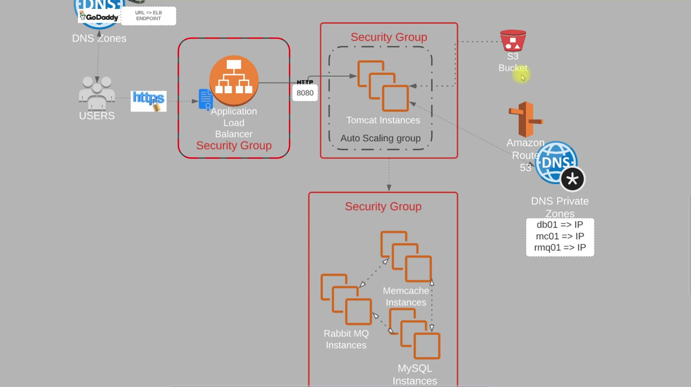

# 2.AWS-Cloud-for-Web-App-Setup-Lift&Shift

## Project Overview

This project involves deploying a Java application on AWS EC2. The architecture includes the setup of four EC2 instances, configuring security groups, and creating various services such as a database, RabbitMQ, Memcached, and Tomcat 10 on each EC2 instance. Additionally, we utilize Route 53 for DNS management by creating a hosted zone to facilitate communication between the instances.

### Architecture Diagram

## Steps Involved

1. **EC2 Instances Creation**:
   - Four EC2 instances were created to host the application components.
   - Security group settings were configured to control inbound and outbound traffic.

2. **Service Configuration**:
   - A database was set up on one of the EC2 instances.
   - RabbitMQ, Memcached, and Tomcat 10 were installed and configured on each instance.

3. **DNS Configuration**:
   - Route 53 was used to define the IP addresses of the instances within a hosted zone, allowing for seamless communication between them.

4. **Application Build and Deployment**:
   - The application was built using Maven on a separate machine.
   - The artifact generated from the build process was uploaded to an S3 bucket.

5. **Artifact Retrieval**:
   - The artifact was retrieved from S3 and deployed to the Tomcat server running on one of the EC2 instances.

6. **Load Balancing**:
   - An Elastic Load Balancer (ELB) was set up to distribute incoming traffic to the Tomcat server, ensuring high availability and reliability.

7. **AMI Creation and Auto Scaling**:
   - An Amazon Machine Image (AMI) was created for the Tomcat server.
   - A launch template was configured with the AMI to create an Auto Scaling Group (ASG), enabling the application to handle traffic spikes efficiently.

8. **Domain Configuration**:
   - Endpoints for the ELB were linked to a GoDaddy domain, allowing HTTPS access to the application.

### Build and Deployment Diagram

## Conclusion

This project demonstrates a robust architecture for deploying a Java application on AWS, utilizing various AWS services to enhance performance, reliability, and scalability. The integration of Route 53 for DNS management and the use of an ELB for load balancing significantly contribute to the application's effectiveness.

## Technologies Used

- AWS EC2
- AWS S3
- AWS Route 53
- AWS ELB
- Maven
- Tomcat 10
- RabbitMQ
- Memcached
